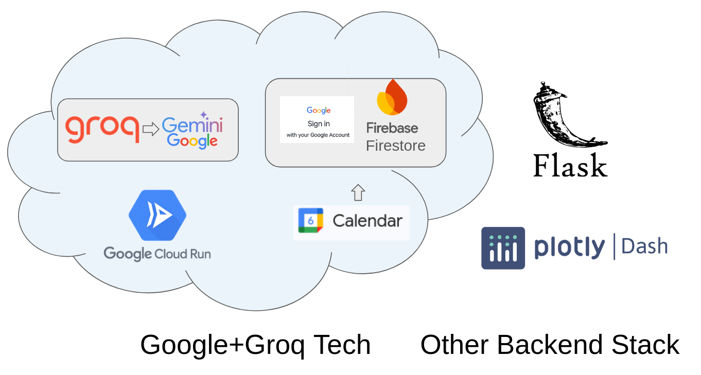
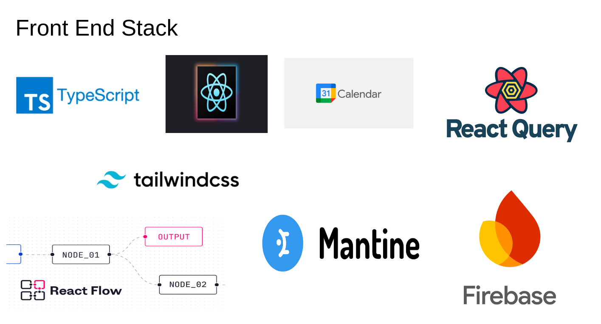

# 📚 StudyMaxx

**StudyMaxx** is a smart, centralized learning companion that empowers students to take charge of their academic success. It generates personalized learning plans, tracks study performance, and fosters motivation through data-driven visualizations and gamified features like leaderboards.

---

## 🧠 Why StudyMaxx?

Modern studying is disjointed—students juggle calendars, task managers, AI tools, and learning platforms across multiple tabs and apps. StudyMaxx streamlines this by integrating everything into one clean, intelligent interface.

---

## ⚙️ Full Stack Architecture

### ☁️ Backend Stack

#### 🔷 Google + Groq Tech
- **Groq → Gemini (Google)**: Ultra-fast inference for personalized, conversational learning assistance.
- **Firebase Firestore**: Real-time, scalable NoSQL database for tracking study logs, goals, and tasks.
- **Google Calendar API**: Seamlessly syncs student schedules and study sessions.
- **Google Sign-In**: One-tap login with secure OAuth2 authentication.
- **Google Cloud Run**: Serverless deployment of microservices for intelligent scheduling and analytics.

#### 🐍 Other Backend Stack
- **Flask**: Lightweight Python API to serve core business logic.
- **Plotly Dash**: Used for creating interactive, visual dashboards—progress, habits, and leaderboard stats.



---

### 🎨 Frontend Stack

#### 🛠 Core Tools
- **React + TypeScript**: Component-based frontend with strong typing and scalability.
- **TailwindCSS**: Utility-first CSS for responsive and fast styling.
- **Mantine UI**: Beautiful, accessible UI components out of the box.

#### ⚡ State & Data
- **React Query**: Robust state and data fetching layer for syncing with the backend.
- **React Flow**: Used to visually represent study plans, progress trees, or concept maps.

#### 📅 Calendar Integration
- **Google Calendar**: Students can view and manage academic schedules in-app.
- **Firebase**: Also used on the frontend for real-time updates and data binding.



---

## 🚧 In Progress

- [ ] AI-generated daily study plans
- [ ] Personalized dashboards with Plotly visualizations
- [ ] Leaderboard gamification with weekly challenges
- [ ] Google Classroom and Canvas LMS integrations
- [ ] Mobile app (React Native) support

---

## 🧪 Local Development

```bash
# Backend
cd backend
pip install -r requirements.txt
flask run

# Frontend
cd frontend
npm install
npm run dev
